# 🐝 HiveLog - منصة النقاشات الذكية

<div align="center">


**منصة نقاشات ذكية تحوّل الحوارات النشطة إلى معرفة منظمة باستخدام الذكاء الاصطناعي**

[العربية](#) • [English](#) • [التوثيق](#) • [Demo](#)

</div>

---

## 📖 جدول المحتويات

- [نظرة عامة](#-نظرة-عامة)
- [الفكرة الأساسية](#-الفكرة-الأساسية)
- [المميزات الرئيسية](#-المميزات-الرئيسية)
- [البنية التقنية](#-البنية-التقنية)
- [هيكل المشروع](#-هيكل-المشروع)
- [التثبيت والإعداد](#-التثبيت-والإعداد)
- [الاستخدام](#-الاستخدام)
- [API Documentation](#-api-documentation)
- [المساهمة](#-المساهمة)
- [الترخيص](#-الترخيص)

---

## 🌟 نظرة عامة

**HiveLog** هي منصة نقاشات مبتكرة تجمع بين قوة المنصات الاجتماعية مثل Reddit وذكاء الويكي المنظم. تعتمد المنصة على نظام فريد من **3 مراحل** يحول النقاشات الحية إلى قاعدة معرفية منظمة باستخدام الذكاء الاصطناعي (GPT-4).

### 🎯 المشكلة التي نحلها

- **النقاشات الطويلة** التي يصعب متابعتها
- **المعلومات المتناثرة** في مئات التعليقات
- **فقدان القيمة** بعد انتهاء النقاش
- **صعوبة استخراج** النقاط الرئيسية والاستنتاجات

### 💡 الحل

نظام ذكي يحول النقاشات النشطة إلى **ويكي متجدد** يحتوي على:
- ملخص منظم للنقاط الرئيسية
- تصنيف للآراء (مؤيد/معارض/محايد)
- ربط بالمصادر الأصلية للتحقق
- تحديث تلقائي عند إضافة محتوى ذو قيمة

---

## 🎯 الفكرة الأساسية

### المراحل الثلاث للتحول الذكي:

```mermaid
graph LR
    A[منشور جديد] --> B[🔥 نقاش نشط<br/>30 يوم]
    B --> C[🤖 تحليل AI<br/>GPT-4]
    C --> D[📚 ويكي متجدد<br/>معرفة منظمة]
    D --> E[♻️ تحديثات مستمرة]
```



#### 1️⃣ مرحلة النقاش النشط (Sandbox Stage)
**المدة:** 30 يوماً أو حتى الوصول لحد التفاعل

**المميزات:**
- 💬 نقاش حيوي مثل Reddit
- 🌳 تعليقات متشعبة (حتى 5 مستويات)
- 👍👎 نظام تصويت متقدم
- 📷 رفع الصور والملفات (حتى 5 صور × 5MB)
- 🔔 إشعارات فورية للتفاعلات
- ⚡ تحديثات حية عبر WebSocket

**شروط الانتقال للمرحلة التالية:**
- مرور 30 يوماً من تاريخ الإنشاء
- **أو** الوصول لـ 100 تعليق + 1000 مشاهدة

#### 2️⃣ مرحلة التجميع الذكي (AI Processing)
**المدة:** عدة دقائق (معالجة تلقائية)

**ما يحدث:**
- 🤖 تحليل كامل للنقاش باستخدام GPT-4
- 📊 استخراج النقاط الرئيسية
- 🏷️ تصنيف الآراء:
  - ✅ مؤيد (Supporting)
  - ❌ معارض (Opposing)
  - ⚖️ محايد (Neutral)
- 📎 تجميع المرفقات والمصادر
- 🎯 تحديد النقاط المعلقة للنقاش
- 📈 حساب مستوى الإجماع (Consensus Score)

#### 3️⃣ مرحلة الويكي المتجدد (Living Wiki)
**المدة:** دائم (مع تحديثات)

**المحتوى:**
- 📝 **ملخص منظم** للنقاش بالكامل
- 🎭 **الآراء المصنفة** مع أمثلة
- 📌 **النقاط الرئيسية** مرتبة حسب الأهمية
- 🔗 **المصادر والمراجع** للتحقق
- ❓ **نقاط معلقة** تحتاج مزيد نقاش
- 📊 **إحصائيات** (نسبة الإجماع، عدد المساهمين)
- 🔄 **تحديثات تلقائية** عند إضافة تعليقات جديدة ذات قيمة

---

## ✨ المميزات الرئيسية

### 🎨 واجهة المستخدم

#### 🌓 1. وضع داكن (Dark Mode)
- تبديل سلس بين الوضع الفاتح والداكن
- حفظ تلقائي للتفضيلات
- دعم كامل لجميع المكونات
- تحسين راحة العين في الإضاءة المنخفضة

#### 💬 2. نظام التعليقات المتشعب
- **تشعب حتى 5 مستويات** من الردود
- **تصويت على كل تعليق** (إعجاب/عدم إعجاب)
- **تعديل وحذف** للمؤلف
- **إخفاء/إظهار** الردود
- **عداد تلقائي** للردود
- **مؤشر المستوى** (depth indicator)
- **تنظيم تلقائي** حسب التصويت

#### 📤 3. نظام رفع الملفات
- **رفع صور متعددة** (حتى 5 صور)
- **سحب وإفلات** (Drag & Drop)
- **معاينة مباشرة** قبل الرفع
- **أنواع مدعومة:** JPEG, JPG, PNG, GIF
- **حد أقصى:** 5MB لكل صورة
- **عرض جميل** في البطاقات والمنشورات
- **فتح في نافذة جديدة** للعرض الكامل

#### 🔔 4. الإشعارات الفورية
- **إشعارات حية** عبر Socket.io
- **أيقونة مع عداد** للإشعارات غير المقروءة
- **قائمة منسدلة** للإشعارات
- **أنواع متعددة:**
  - 💬 تعليق جديد على منشورك
  - 💭 رد على تعليقك
  - 👍 تصويت على منشورك
  - 📚 تحول منشورك لويكي
  - 🔄 انتقال منشورك لمرحلة جديدة
- **وضع علامة مقروء** (فردي أو جماعي)
- **حذف الإشعارات**
- **حذف تلقائي** بعد 30 يوم

#### 🔍 5. بحث متقدم مع فلاتر
- **فلاتر متنوعة:**
  - 📊 **الترتيب:** الأكثر نشاطاً، الأحدث، الأعلى تقييماً، الرائج
  - 📁 **المرحلة:** نقاش نشط، قيد المعالجة، ويكي
  - 🏷️ **الفئات:** سؤال، نقاش، فكرة، تجربة، طلب مساعدة، عام
  - 📅 **النطاق الزمني:** اليوم، الأسبوع، الشهر، السنة
  - 🔖 **البحث بالوسوم:** فلترة متقدمة
- **واجهة سهلة** مع عداد الفلاتر النشطة
- **تحديث URL** تلقائياً للمشاركة
- **نتائج فورية** مع React Query

---

## 🆕 الميزات المضافة حديثاً (ديسمبر 2024)

### 🛡️ نظام الإدارة الكامل (RBAC - Role-Based Access Control)

#### الأدوار الأربعة:
1. **👤 User** (مستخدم عادي)
   - إنشاء المنشورات والتعليقات
   - التصويت والتفاعل
   - إدارة الملف الشخصي

2. **👮 Moderator** (مشرف)
   - جميع صلاحيات المستخدم
   - الإشراف على المحتوى
   - معالجة البلاغات
   - حذف المحتوى المخالف

3. **👨‍💼 Admin** (مدير)
   - جميع صلاحيات المشرف
   - إدارة المستخدمين
   - تعيين الأدوار
   - إدارة الإعدادات
   - عرض الإحصائيات

4. **👑 Super Admin** (مدير أعلى)
   - صلاحيات كاملة بدون قيود
   - إدارة المدراء الآخرين
   - الوصول لجميع الإعدادات الحساسة

#### الصلاحيات الـ 12:
- ✅ `manage_users` - إدارة المستخدمين
- ✅ `manage_posts` - إدارة المنشورات
- ✅ `manage_comments` - إدارة التعليقات
- ✅ `manage_reports` - إدارة البلاغات
- ✅ `manage_roles` - إدارة الأدوار والصلاحيات
- ✅ `view_analytics` - عرض الإحصائيات والتحليلات
- ✅ `manage_settings` - إدارة إعدادات النظام
- ✅ `manage_categories` - إدارة التصنيفات
- ✅ `moderate_content` - الإشراف على المحتوى
- ✅ `ban_users` - حظر/إلغاء حظر المستخدمين
- ✅ `manage_wiki` - إدارة صفحات الويكي
- ✅ `access_admin_panel` - الوصول للوحة الإدارة

#### صفحات لوحة الإدارة:

**1. لوحة التحكم الرئيسية** (`/admin`)
- 📊 إحصائيات شاملة (مستخدمين، منشورات، تعليقات، بلاغات)
- 📈 رسوم بيانية للنشاط
- 📋 آخر الأنشطة
- ⚠️ البلاغات المعلقة
- 🎯 مؤشرات الأداء

**2. إدارة المستخدمين** (`/admin/users`)
- عرض جميع المستخدمين في جدول منظم
- 🔍 البحث والتصفية المتقدمة
- 🎭 تغيير الأدوار والصلاحيات
- 🚫 حظر/إلغاء حظر المستخدمين
- 👁️ عرض تفاصيل المستخدم الكاملة
- 📊 إحصائيات النشاط لكل مستخدم

**3. إدارة البلاغات** (`/admin/reports`)
- عرض جميع بلاغات المستخدمين
- 🏷️ تصفية حسب النوع (منشور، تعليق، مستخدم)
- 📊 تصفية حسب الحالة (معلق، قيد المراجعة، تم الحل، مرفوض)
- ✅ اتخاذ إجراءات سريعة:
  - حذف المحتوى
  - حظر المستخدم
  - رفض البلاغ
  - إضافة ملاحظات
- 📝 تتبع المشرف المسؤول

### 🎨 تحسينات الواجهة

#### Dark Mode دائم مع ثيم أصفر
- 🌙 **Dark Mode افتراضي** - لا يمكن تغييره لراحة العين
- 💛 **ثيم أصفر أنيق** (#eab308) بدلاً من الأزرق/البرتقالي
- 🎨 تصميم متناسق عبر جميع الصفحات
- ✨ ألوان متدرجة من الأصفر للواجهة
- 🔄 إزالة زر تبديل الثيم - Dark Mode دائم

### 🐛 إصلاحات حرجة

#### 1. مشكلة تسجيل الخروج التلقائي
- **المشكلة:** كان المستخدم يُسجل خروجه تلقائياً عند التنقل بين الصفحات
- **السبب:** عدم حفظ حالة المصادقة في localStorage
- **الحل:** إضافة Zustand persist middleware
- **النتيجة:** ✅ الآن تبقى مسجل دخول حتى بعد إعادة تحميل الصفحة

#### 2. عدم ظهور الردود على التعليقات
- **المشكلة:** التعليقات تظهر لكن الردود المتداخلة لا تظهر
- **السبب:** Backend لا يُرجع الردود مع التعليقات
- **الحل:** إضافة دالة تكرارية `populateReplies()` في backend
- **النتيجة:** ✅ الآن تظهر جميع الردود حتى 5 مستويات من التداخل

#### 3. أخطاء الاستيراد في Routes
- **المشكلة:** أخطاء في middleware imports
- **الحل:** تصحيح جميع imports من `auth` إلى `{ authenticate }`
- **النتيجة:** ✅ Backend يعمل بدون أخطاء

### 🔐 نظام إنشاء المدير الآمن

#### كيفية إنشاء أول حساب مدير:

**الخطوة 1: الحصول على المفتاح السري**

افتح ملف `.env` في مجلد `backend`:
```bash
cd backend
cat .env | grep ADMIN_SECRET_KEY
```

ستجد المفتاح:
```
ADMIN_SECRET_KEY=hivelog-admin-setup-2024
```

**الخطوة 2: الانتقال لصفحة إنشاء المدير**

افتح المتصفح وانتقل إلى:
```
http://localhost:3000/create-admin
```

**الخطوة 3: ملء نموذج التسجيل**

ستجد نموذج يطلب:
- 📝 **اسم المستخدم**: اختر اسماً فريداً (مثال: admin)
- 📧 **البريد الإلكتروني**: أدخل بريدك
- 🔒 **كلمة المرور**: اختر كلمة مرور قوية (8 أحرف على الأقل)
- 🔑 **المفتاح السري**: الصق المفتاح من ملف `.env`

**الخطوة 4: إنشاء الحساب**

- اضغط على زر "إنشاء حساب المدير"
- ✅ سيتم إنشاء حساب Super Admin
- ✅ سيتم منحك جميع الصلاحيات الـ 12
- ✅ سيتم تسجيل دخولك تلقائياً
- ✅ سيتم توجيهك للوحة الإدارة `/admin`

**ملاحظات أمنية:**
- ⚠️ يمكن إنشاء مدير واحد فقط عبر هذه الطريقة
- ⚠️ بعد إنشاء أول مدير، لن يعمل هذا الـ endpoint مرة أخرى
- ⚠️ لإنشاء مدراء إضافيين، استخدم لوحة الإدارة
- ⚠️ لا تشارك المفتاح السري مع أحد
- ⚠️ لا ترفع ملف `.env` على GitHub (محمي في `.gitignore`)

**للمزيد من التفاصيل:** راجع ملف [ADMIN_SETUP.md](./ADMIN_SETUP.md)

---

### 🤖 الذكاء الاصطناعي

#### 📊 تحليل النقاشات
- استخدام **GPT-4** للتحليل العميق
- تصنيف الآراء بدقة عالية
- استخراج النقاط الرئيسية
- تحديد مستوى الإجماع

#### 🔄 التحديث التلقائي
- **Cron Job** يعمل كل ساعة
- فحص المنشورات التي تحتاج انتقال
- معالجة تلقائية في الخلفية
- تحديث الويكي عند إضافة تعليقات جديدة

#### 🎯 الجودة والدقة
- **مصادر موثقة:** كل ملخص مرتبط بالتعليقات الأصلية
- **قابل للتحقق:** يمكن مراجعة النقاش الأصلي
- **شفافية كاملة:** عرض عملية التحليل

### 🔐 الأمان والأداء

#### 🛡️ المصادقة والتحقق
- **JWT Tokens** للأمان
- **bcrypt** لتشفير كلمات المرور
- **Middleware** للحماية
- **مسارات محمية** (Protected Routes)

#### ⚡ الأداء
- **React Query** للتخزين المؤقت الذكي
- **Code Splitting** لتحميل أسرع
- **Lazy Loading** للصور
- **WebSocket** للتحديثات الفورية
- **Indexing** في MongoDB للبحث السريع

---

## 🏗️ البنية التقنية

### Backend Stack

```javascript
{
  "runtime": "Node.js 18.x",
  "framework": "Express.js 4.x",
  "database": "MongoDB 8.0",
  "ai": "OpenAI GPT-4",
  "realtime": "Socket.io",
  "auth": "JWT + bcrypt",
  "fileUpload": "Multer",
  "scheduling": "node-cron"
}
```

**المكتبات الرئيسية:**
- `express` - إطار عمل الويب
- `mongoose` - ODM لـ MongoDB
- `socket.io` - اتصالات حية
- `openai` - تكامل GPT-4
- `jsonwebtoken` - مصادقة JWT
- `bcryptjs` - تشفير كلمات المرور
- `multer` - رفع الملفات
- `node-cron` - جدولة المهام
- `helmet` - أمان HTTP
- `cors` - التعامل مع CORS
- `morgan` - سجلات HTTP
- `dotenv` - متغيرات البيئة

### Frontend Stack

```javascript
{
  "library": "React 18.x",
  "styling": "Tailwind CSS 3.x",
  "stateManagement": "Zustand",
  "dataFetching": "React Query",
  "routing": "React Router 6.x",
  "forms": "React Hook Form",
  "icons": "Lucide React",
  "dates": "date-fns",
  "notifications": "React Hot Toast"
}
```

**المكتبات الرئيسية:**
- `react` - مكتبة UI
- `react-router-dom` - التنقل
- `@tanstack/react-query` - إدارة البيانات
- `zustand` - إدارة الحالة
- `axios` - طلبات HTTP
- `tailwindcss` - تصميم CSS
- `socket.io-client` - اتصالات حية
- `lucide-react` - أيقونات
- `date-fns` - تنسيق التواريخ
- `react-hot-toast` - إشعارات
- `vite` - أداة البناء

---

## 📁 هيكل المشروع

```
HiveLog/
├── 📂 backend/                    # خادم Node.js/Express
│   ├── 📂 models/                 # نماذج Mongoose
│   │   ├── User.js               # نموذج المستخدم
│   │   ├── Post.js               # نموذج المنشور (3 مراحل)
│   │   ├── Comment.js            # نموذج التعليق (متشعب)
│   │   ├── Wiki.js               # نموذج الويكي
│   │   └── Notification.js       # نموذج الإشعارات
│   │
│   ├── 📂 routes/                 # مسارات API
│   │   ├── auth.js               # مصادقة (تسجيل/دخول)
│   │   ├── posts.js              # منشورات (CRUD + Vote)
│   │   ├── comments.js           # تعليقات (CRUD + Vote + Nested)
│   │   ├── wiki.js               # ويكي (Read + Update)
│   │   ├── users.js              # مستخدمين (Profile)
│   │   ├── upload.js             # رفع ملفات
│   │   └── notifications.js      # إشعارات
│   │
│   ├── 📂 services/               # الخدمات
│   │   ├── aiService.js          # تكامل GPT-4
│   │   ├── transitionService.js  # انتقال المراحل
│   │   └── notificationService.js # إدارة الإشعارات
│   │
│   ├── 📂 middleware/             # وسيطات
│   │   ├── auth.js               # مصادقة JWT
│   │   └── upload.js             # إعداد Multer
│   │
│   ├── 📂 uploads/                # الملفات المرفوعة
│   ├── server.js                 # نقطة البداية
│   ├── package.json              # المكتبات
│   └── .env.example              # مثال متغيرات البيئة
│
├── 📂 frontend/                   # تطبيق React
│   ├── 📂 src/
│   │   ├── 📂 components/        # مكونات React
│   │   │   ├── 📂 Layout/        # Layout (Header, Sidebar, Footer)
│   │   │   ├── 📂 Post/          # PostCard, StageBadge
│   │   │   ├── 📂 Comment/       # CommentForm, CommentItem, CommentSection
│   │   │   ├── 📂 Upload/        # ImageUploader
│   │   │   ├── 📂 Notification/  # NotificationCenter
│   │   │   ├── 📂 Search/        # SearchFilters
│   │   │   └── 📂 ThemeToggle/   # ThemeToggle
│   │   │
│   │   ├── 📂 pages/             # صفحات التطبيق
│   │   │   ├── HomePage.jsx      # الصفحة الرئيسية + فلاتر
│   │   │   ├── PostPage.jsx      # صفحة المنشور + تعليقات
│   │   │   ├── CreatePostPage.jsx # إنشاء منشور + رفع صور
│   │   │   ├── WikiPage.jsx      # صفحة الويكي
│   │   │   ├── ProfilePage.jsx   # الملف الشخصي
│   │   │   ├── LoginPage.jsx     # تسجيل الدخول
│   │   │   └── RegisterPage.jsx  # التسجيل
│   │   │
│   │   ├── 📂 stores/            # Zustand Stores
│   │   │   ├── authStore.js      # حالة المصادقة
│   │   │   ├── themeStore.js     # حالة الثيم (Dark Mode)
│   │   │   └── notificationStore.js # حالة الإشعارات
│   │   │
│   │   ├── 📂 services/          # خدمات API
│   │   │   ├── api.js            # Axios instance
│   │   │   └── socket.js         # Socket.io client
│   │   │
│   │   ├── App.jsx               # المكون الرئيسي
│   │   ├── main.jsx              # نقطة البداية
│   │   └── index.css             # أنماط عامة
│   │
│   ├── public/                   # ملفات ثابتة
│   ├── index.html                # HTML الرئيسي
│   ├── package.json              # المكتبات
│   ├── vite.config.js            # إعدادات Vite
│   └── tailwind.config.js        # إعدادات Tailwind
│
├── 📂 docs/                       # التوثيق
│   ├── API_DOCUMENTATION.md      # توثيق API
│   ├── SETUP_GUIDE.md            # دليل الإعداد
│   ├── PROJECT_OVERVIEW.md       # نظرة عامة
│   └── CONTRIBUTING.md           # دليل المساهمة
│
├── README.md                     # هذا الملف
├── .gitignore                    # ملفات Git المتجاهلة
└── LICENSE                       # رخصة MIT
```

---

## 🚀 التثبيت والإعداد

### المتطلبات الأساسية

قبل البدء، تأكد من تثبيت:

- **Node.js** >= 18.x ([تحميل](https://nodejs.org/))
- **MongoDB** >= 8.0 ([تحميل](https://www.mongodb.com/try/download/community))
- **npm** أو **yarn**
- **OpenAI API Key** ([احصل عليه](https://platform.openai.com/api-keys))

### 1️⃣ استنساخ المشروع

```bash
git clone https://github.com/yourusername/HiveLog.git
cd HiveLog
```

### 2️⃣ إعداد Backend

```bash
# الانتقال لمجلد Backend
cd backend

# تثبيت المكتبات
npm install

# إنشاء ملف البيئة
cp .env.example .env
```

**تعديل ملف `.env`:**

```env
# Server
PORT=5000
NODE_ENV=development

# MongoDB
MONGODB_URI=mongodb://localhost:27017/hivelog

# JWT
JWT_SECRET=your-super-secret-jwt-key-change-this-in-production
JWT_EXPIRE=7d

# OpenAI
OPENAI_API_KEY=sk-your-openai-api-key-here

# Frontend URL (for CORS)
FRONTEND_URL=http://localhost:3000
```

**تشغيل MongoDB:**

```bash
# macOS (Homebrew)
brew services start mongodb-community@8.0

# أو تشغيل مباشر
mongod --config /usr/local/etc/mongod.conf

# Linux (systemd)
sudo systemctl start mongod

# Windows
net start MongoDB
```

**تشغيل Backend:**

```bash
npm run dev
```

✅ يجب أن ترى:
```
✅ Connected to MongoDB
🚀 Server running on port 5000
```

### 3️⃣ إعداد Frontend

**في نافذة terminal جديدة:**

```bash
# الانتقال لمجلد Frontend
cd frontend

# تثبيت المكتبات
npm install

# تشغيل التطبيق
npm run dev
```

✅ يجب أن ترى:
```
  VITE v5.x.x  ready in xxx ms

  ➜  Local:   http://localhost:3000/
  ➜  Network: use --host to expose
```

### 4️⃣ فتح التطبيق

افتح المتصفح وانتقل إلى:
```
http://localhost:3000
```

🎉 **مبروك! المنصة جاهزة للاستخدام**

---

## 💻 الاستخدام

### إنشاء حساب

1. انقر على **"تسجيل"** في الصفحة الرئيسية
2. أدخل البيانات المطلوبة:
   - اسم المستخدم (3-30 حرف)
   - البريد الإلكتروني
   - كلمة المرور (6 أحرف على الأقل)
3. انقر **"إنشاء حساب"**

### إنشاء منشور

1. انقر على **"منشور جديد"** في الأعلى
2. اختر **الفئة** المناسبة:
   - 🤔 سؤال
   - 💬 نقاش
   - 💡 فكرة
   - 🧪 تجربة
   - 🆘 طلب مساعدة
   - 📝 عام
3. أدخل **العنوان** (5-300 حرف)
4. اكتب **المحتوى** (10+ أحرف)
5. أضف **الوسوم** (اختياري): `برمجة, ذكاء_اصطناعي`
6. **ارفع صور** (اختياري): حتى 5 صور
7. انقر **"نشر المنشور"**

### التفاعل مع المنشورات

#### التصويت
- 👍 **Upvote:** إعجاب بالمحتوى
- 👎 **Downvote:** عدم إعجاب

#### التعليق
1. اكتب تعليقك في الصندوق
2. انقر **"تعليق"**
3. للرد على تعليق: انقر **"رد"**

#### الإشعارات
- 🔔 أيقونة الجرس في الأعلى
- عداد للإشعارات غير المقروءة
- انقر لفتح القائمة
- انقر على إشعار للانتقال للمنشور

### البحث والفلترة

1. استخدم **شريط البحث** في الأعلى
2. انقر على **"تصفية"** لفتح الفلاتر:
   - اختر **الترتيب**
   - حدد **المرحلة**
   - اختر **الفئات** (متعدد)
   - حدد **النطاق الزمني**
   - ابحث بـ **الوسوم**
3. انقر **"تطبيق"**

### الوضع الداكن

- انقر على أيقونة **🌙/☀️** في الأعلى
- يتم حفظ التفضيل تلقائياً

---

## 📡 API Documentation

### نقاط النهاية الرئيسية

#### المصادقة

```http
POST /api/auth/register
Content-Type: application/json

{
  "username": "string",
  "email": "string",
  "password": "string"
}
```

```http
POST /api/auth/login
Content-Type: application/json

{
  "email": "string",
  "password": "string"
}
```

#### المنشورات

```http
GET /api/posts
Query Parameters:
  - stage: sandbox|processing|wiki
  - category: string
  - sort: hot|new|top|trending
  - search: string
  - page: number
  - limit: number
```

```http
POST /api/posts
Authorization: Bearer <token>
Content-Type: application/json

{
  "title": "string",
  "content": "string",
  "category": "string",
  "tags": ["string"],
  "attachments": [...]
}
```

```http
POST /api/posts/:id/vote
Authorization: Bearer <token>
Content-Type: application/json

{
  "voteType": "upvote|downvote"
}
```

#### التعليقات

```http
GET /api/comments/post/:postId
```

```http
POST /api/comments
Authorization: Bearer <token>
Content-Type: application/json

{
  "postId": "string",
  "content": "string",
  "parentComment": "string|null"
}
```

#### رفع الملفات

```http
POST /api/upload/image
Authorization: Bearer <token>
Content-Type: multipart/form-data

image: File
```

```http
POST /api/upload/images
Authorization: Bearer <token>
Content-Type: multipart/form-data

images: File[]
```

#### الإشعارات

```http
GET /api/notifications
Authorization: Bearer <token>
Query Parameters:
  - page: number
  - limit: number
  - unreadOnly: boolean
```

```http
PUT /api/notifications/:id/read
Authorization: Bearer <token>
```

للتوثيق الكامل، راجع: [API_DOCUMENTATION.md](./docs/API_DOCUMENTATION.md)

#### نقاط نهاية الإدارة (Admin) 🆕

```http
POST /api/auth/create-admin
Content-Type: application/json

{
  "username": "admin",
  "email": "admin@example.com",
  "password": "securePassword123",
  "secretKey": "hivelog-admin-setup-2024"
}

Response: {
  "message": "Admin created successfully",
  "token": "jwt-token",
  "user": {
    "_id": "...",
    "username": "admin",
    "role": "super_admin",
    "permissions": [/* all 12 permissions */]
  }
}
```

```http
GET /api/admin/stats
Authorization: Bearer <token>
Permissions: view_analytics

Response: {
  "users": { "total": 100, "active": 80, "new": 10 },
  "posts": { "total": 500, "active": 50, "wiki": 30 },
  "comments": { "total": 2000, "today": 50 },
  "reports": { "pending": 5, "resolved": 20 }
}
```

```http
GET /api/admin/users
Authorization: Bearer <token>
Permissions: manage_users
Query Parameters:
  - page: number
  - limit: number
  - search: string
  - role: string
  - sortBy: string

Response: {
  "users": [...],
  "pagination": { "total": 100, "pages": 10 }
}
```

```http
PUT /api/admin/users/:id/role
Authorization: Bearer <token>
Permissions: manage_roles

{
  "role": "moderator",
  "permissions": ["moderate_content", "manage_reports"]
}
```

```http
POST /api/admin/users/:id/ban
Authorization: Bearer <token>
Permissions: ban_users

{
  "reason": "Violation of terms",
  "duration": 7 // days, or null for permanent
}
```

```http
GET /api/admin/reports
Authorization: Bearer <token>
Permissions: manage_reports
Query Parameters:
  - status: pending|reviewing|resolved|rejected
  - type: post|comment|user
  - page: number
  - limit: number

Response: {
  "reports": [...],
  "pagination": { "total": 50, "pages": 5 }
}
```

```http
PUT /api/admin/reports/:id
Authorization: Bearer <token>
Permissions: manage_reports

{
  "status": "resolved",
  "action": "deleted_content|banned_user|warned_user|rejected",
  "notes": "Content removed for violating terms"
}
```

---

## 🧪 الاختبار

```bash
# Backend Tests
cd backend
npm test

# Frontend Tests
cd frontend
npm test

# E2E Tests
npm run test:e2e
```

---

## 🚢 النشر (Deployment)

### Backend (Node.js)

**خيارات النشر:**
- **Heroku**
- **Railway**
- **Render**
- **DigitalOcean**
- **AWS EC2**

**خطوات عامة:**

1. تأكد من ملف `.env` في الخادم
2. قم بتشغيل:
```bash
npm run build
npm start
```

### Frontend (React)

**خيارات النشر:**
- **Vercel** (موصى به)
- **Netlify**
- **GitHub Pages**
- **Cloudflare Pages**

**بناء للإنتاج:**

```bash
cd frontend
npm run build
```

### MongoDB

**خيارات:**
- **MongoDB Atlas** (موصى به للسحابة)
- **Self-hosted** على VPS

---

## 🤝 المساهمة

نرحب بالمساهمات! لتساهم في المشروع:

### خطوات المساهمة

1. **Fork** المشروع
2. أنشئ **branch** جديد:
   ```bash
   git checkout -b feature/amazing-feature
   ```
3. قم بالتعديلات والـ **commit**:
   ```bash
   git commit -m 'إضافة ميزة رائعة'
   ```
4. **Push** للـ branch:
   ```bash
   git push origin feature/amazing-feature
   ```
5. افتح **Pull Request**

### إرشادات الكود

- استخدم **ES6+** syntax
- اتبع **ESLint** rules
- اكتب **تعليقات** واضحة بالعربية
- اختبر التعديلات قبل الـ PR

للمزيد: [CONTRIBUTING.md](./docs/CONTRIBUTING.md)

---

## 🐛 الإبلاغ عن مشاكل

وجدت مشكلة؟ [افتح Issue](https://github.com/yourusername/HiveLog/issues/new)

عند الإبلاغ عن مشكلة، يرجى تضمين:
- 📝 وصف واضح للمشكلة
- 🔄 خطوات إعادة الإنتاج
- 💻 البيئة (OS, Node version, etc.)
- 📸 صور/فيديوهات (إن أمكن)

---

## 📞 الدعم

- 📧 **البريد الإلكتروني:** support@hivelog.com
- 💬 **Discord:** [انضم للمجتمع](https://discord.gg/hivelog)
- 🐦 **Twitter:** [@HiveLog](https://twitter.com/hivelog)
- 📘 **التوثيق:** [docs.hivelog.com](https://docs.hivelog.com)

---

## 🗺️ خارطة الطريق

### ✅ الإصدار 1.0 (الحالي)
- [x] نظام المراحل الثلاث
- [x] تعليقات متشعبة
- [x] رفع الصور
- [x] إشعارات فورية
- [x] بحث متقدم
- [x] وضع داكن

### 🔜 الإصدار 1.1 (قريباً)
- [ ] لوحة تحكم المستخدم
- [ ] نظام الإشارات (@mentions)
- [ ] حفظ المنشورات (Bookmarks)
- [ ] تحسينات AI (تحليل المشاعر)

### 🚀 الإصدار 2.0 (مستقبلاً)
- [ ] Rate Limiting & Caching
- [ ] نظام الإشراف (Moderation)
- [ ] تطبيق موبايل (React Native)
- [ ] دعم متعدد اللغات

---

## 🙏 شكر وتقدير

هذا المشروع مبني باستخدام:
- [React](https://react.dev/)
- [Node.js](https://nodejs.org/)
- [MongoDB](https://www.mongodb.com/)
- [OpenAI](https://openai.com/)
- [Tailwind CSS](https://tailwindcss.com/)

شكر خاص لكل المساهمين والمستخدمين! 💙

---

## 📄 الترخيص

هذا المشروع مرخص بموجب **MIT License** - راجع ملف [LICENSE](./LICENSE) للتفاصيل.

```
MIT License

Copyright (c) 2025 HiveLog

Permission is hereby granted, free of charge, to any person obtaining a copy
of this software and associated documentation files (the "Software"), to deal
in the Software without restriction...
```

---

## 🌟 النجوم والمتابعة

إذا أعجبك المشروع، لا تنسَ:
- ⭐ إعطاء نجمة للمشروع
- 🔔 متابعة التحديثات
- 📢 مشاركة المشروع مع الأصدقاء

---

<div align="center">

**صُنع بـ ❤️ في العالم العربي**

[⬆ العودة للأعلى](#-hivelog---منصة-النقاشات-الذكية)

</div>
